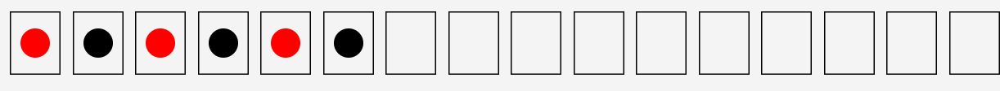
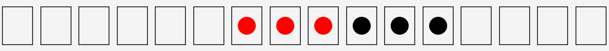

# StoneAligner

Consider 16 small boxes arranged in a line, 3 red stones, and 3 black stones. Initially, the stones are placed in the boxes as follows:

In a move, two adjacent stones must be taken out of the boxes with the condition that one stone can not be moved alone, then they must be put into two adjacent empty boxes preserving their order.
When you press on one stone the next one to it will be automatically selected as when we select 1, it will be 1 and 2, and the same for the boxes.

The goal of the game is to arrange the stones in the following order:

# Solution:
### **Consider that these are the indexes of the Boxes, where [from:0] means move from the first box**

### 1- [from:3 , to:6]
### 2- [from:5 , to:3]
### 3- [from:1 , to:5]
### 4- [from:6 , to:1]

